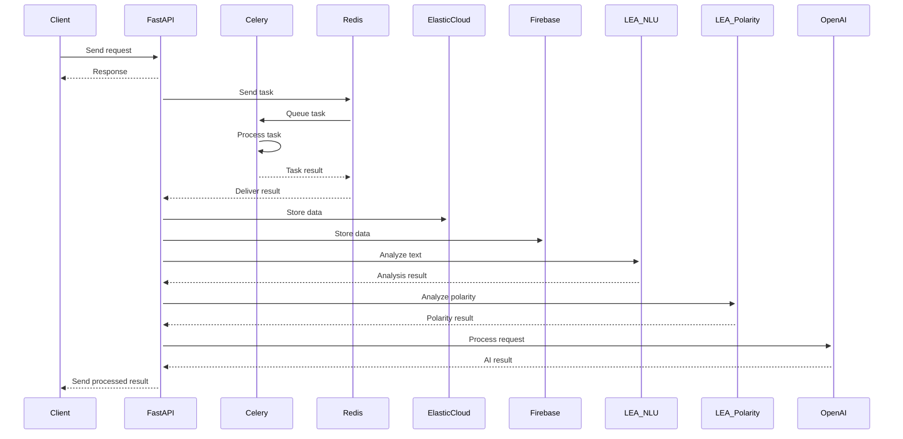

# Proyecto Profesional

Este proyecto es una aplicación profesional que utiliza varias tecnologías modernas para proporcionar una solución completa y escalable. Las tecnologías utilizadas incluyen Celery, Redis, Elastic Cloud, Firebase (Firestore y Firestorage), FastAPI, LEA NLU, LEA Polarity y OpenAI. La aplicación está diseñada para manejar tareas asíncronas, almacenar y buscar datos, gestionar archivos, proporcionar una API rápida y eficiente, y realizar procesamiento avanzado de lenguaje natural.

## Estructura de carpetas del proyecto

```
project-root/
│
├── app/
│   ├── main.py                # Punto de entrada principal de la aplicación FastAPI
│   ├── api/                   # Contiene los endpoints de la API
│   │   ├── v1/                # Versión 1 de la API
│   │   │   ├── endpoints.py   # Definición de los endpoints
│   │   │   └── schemas.py     # Esquemas de datos para la API
│   ├── models/                # Definición de los modelos de datos
│   │   └── user.py            # Modelo de usuario
│   ├── services/              # Lógica de negocio y servicios
│   │   └── user_service.py    # Servicio para la gestión de usuarios
│   └── utils/                 # Utilidades y funciones auxiliares
│       └── helpers.py         # Funciones de ayuda
│
├── celery/
│   ├── tasks.py               # Definición de tareas de Celery
│   └── worker.py              # Configuración del worker de Celery
│
├── config/
│   ├── settings.py            # Configuración general del proyecto
│   └── celery_config.py       # Configuración específica de Celery
│
├── docker/
│   ├── Dockerfile             # Definición del Dockerfile para construir la imagen
│   └── docker-compose.yml     # Definición del docker-compose para orquestar los servicios
│
├── tests/
│   ├── test_api.py            # Pruebas unitarias para los endpoints de la API
│   ├── test_models.py         # Pruebas unitarias para los modelos de datos
│   └── test_services.py       # Pruebas unitarias para los servicios
│
└── README.md                  # Documentación del proyecto
```

## Descripción de los componentes del sistema

- **Celery**: Un sistema de cola de tareas distribuido que se utiliza para manejar tareas asíncronas.
- **Redis**: Una base de datos en memoria que se utiliza como broker de mensajes para Celery.
- **Elastic Cloud**: Un servicio de búsqueda y análisis que se utiliza para almacenar y buscar datos.
- **Firebase (Firestore y Firestorage)**: Servicios de base de datos y almacenamiento en la nube proporcionados por Google.
- **FastAPI**: Un framework web moderno y rápido para construir APIs con Python.
- **LEA NLU**: Un componente de procesamiento de lenguaje natural.
- **LEA Polarity**: Un componente para análisis de polaridad de texto.
- **OpenAI**: Un servicio de inteligencia artificial que se utiliza para diversas tareas de procesamiento de lenguaje natural.

## Descripción de la funcionalidad del sistema

El sistema está diseñado para manejar tareas asíncronas, almacenar y buscar datos, y proporcionar una API rápida y moderna para interactuar con estos datos. Las funcionalidades principales incluyen:

- Procesamiento de tareas asíncronas con Celery y Redis.
- Almacenamiento y búsqueda de datos con Elastic Cloud.
- Gestión de datos y archivos con Firebase.
- Provisión de una API rápida y eficiente con FastAPI.
- Procesamiento de lenguaje natural con LEA NLU y LEA Polarity.
- Uso de modelos de inteligencia artificial de OpenAI para diversas tareas.

## Entradas y salidas del sistema

Las entradas y salidas del sistema varían según el componente:

- **FastAPI**: Recibe solicitudes HTTP y devuelve respuestas HTTP. Las entradas pueden ser datos JSON, y las salidas son respuestas JSON.
- **Celery**: Recibe tareas a través de Redis y devuelve resultados de tareas. Las entradas son tareas en formato JSON, y las salidas son resultados de tareas en formato JSON.
- **Elastic Cloud**: Recibe consultas de búsqueda y devuelve resultados de búsqueda. Las entradas son consultas en formato JSON, y las salidas son resultados de búsqueda en formato JSON.
- **Firebase**: Recibe y almacena datos y archivos, y permite su recuperación. Las entradas son datos y archivos, y las salidas son datos y archivos recuperados.
- **LEA NLU y LEA Polarity**: Reciben texto y devuelven análisis de lenguaje natural y polaridad. Las entradas son texto en formato JSON, y las salidas son análisis en formato JSON.
- **OpenAI**```markdown
: Recibe solicitudes de procesamiento de lenguaje natural y devuelve resultados. Las entradas son solicitudes en formato JSON, y las salidas son resultados en formato JSON.

## Descripción de los endpoints del sistema

- **/api/v1/tasks**: Para crear y gestionar tareas. Métodos: GET, POST.
- **/api/v1/results**: Para recuperar resultados de tareas. Métodos: GET.
- **/api/v1/search**: Para realizar búsquedas en Elastic Cloud. Métodos: GET, POST.
- **/api/v1/files**: Para gestionar archivos en Firebase. Métodos: GET, POST, DELETE.
- **/api/v1/nlu**: Para análisis de lenguaje natural con LEA NLU. Métodos: POST.
- **/api/v1/polarity**: Para análisis de polaridad con LEA Polarity. Métodos: POST.
- **/api/v1/openai**: Para interactuar con los modelos de OpenAI. Métodos: POST.

## Links o referencias al swagger del repositorio

La documentación de Swagger se puede acceder en la ruta `/docs` de la API.

- **URL**: `http://localhost:8000/docs`
- **Descripción**: La documentación de Swagger proporciona una interfaz interactiva donde los desarrolladores pueden explorar y probar los endpoints de la API.

## Links o referencias a documentación de las clases

La documentación de las clases se puede encontrar en la carpeta `docs/`.

- **URL**: `http://localhost:8000/docs/classes`
- **Descripción**: La documentación de las clases incluye descripciones detalladas de las clases y métodos, ejemplos de uso, y referencias a la documentación oficial de las bibliotecas utilizadas.

## Links o referencias a documentación de las pruebas unitarias

La documentación de las pruebas unitarias se puede encontrar en la carpeta `tests/docs/`.

- **URL**: `http://localhost:8000/docs/tests`
- **Descripción**: La documentación de las pruebas unitarias incluye descripciones de las pruebas, ejemplos de casos de prueba, y referencias a la documentación oficial de las bibliotecas de pruebas utilizadas.

## Mermaid graph de cómo se conectan los componentes del sistema

El siguiente diagrama muestra cómo se conectan los diferentes componentes del sistema y cómo fluyen los datos entre ellos:



## Explicación de los Dockerfiles

### Dockerfile para la aplicación web
```dockerfile
FROM python:3.8-slim

# Establecer el directorio de trabajo
WORKDIR /app

# Copiar los archivos de requisitos y el código fuente
COPY requirements.txt requirements.txt
COPY . .

# Instalar las dependencias
RUN pip install -r requirements.txt

# Exponer el puerto de la aplicación
EXPOSE 8000

# Comando para ejecutar la aplicación
CMD ["uvicorn", "app.main:app", "--host", "0.0.0.0", "--port", "8000"]
```

### Dockerfile para Celery
```dockerfile
FROM python:3.8-slim

# Establecer el directorio de trabajo
WORKDIR /app

# Copiar los archivos de requisitos y el código fuente
COPY requirements.txt requirements.txt
COPY . .

# Instalar las dependencias
RUN pip install -r requirements.txt

# Comando para ejecutar el worker de Celery
CMD ["celery", "-A", "app.celery", "worker", "--loglevel=info"]
```

### Dockerfile para Redis
```dockerfile
FROM redis:alpine

# Exponer el puerto de Redis
EXPOSE 6379
```

### Dockerfile para Elasticsearch
```dockerfile
FROM docker.elastic.co/elasticsearch/elasticsearch:7.10.1

# Configuración de Elasticsearch
ENV discovery.type=single-node

# Exponer el puerto de Elasticsearch
EXPOSE 9200
```

## Definición del docker-compose

```yaml
version: '3.8'

services:
  web:
    build: .
    ports:
      - "8000:8000"
    volumes:
      - .:/app
    depends_on:
      - redis
      - celery

  redis:
    image: "redis:alpine"

  celery:
    build: .
    command: celery -A app.celery worker --loglevel=info
    volumes:
      - .:/app
    depends_on:
      - redis

  elasticsearch:
    image: docker.elastic.co/elasticsearch/elasticsearch:7.10.1
    environment:
      - discovery.type=single-node
    ports:
      - "9200:9200"
```
