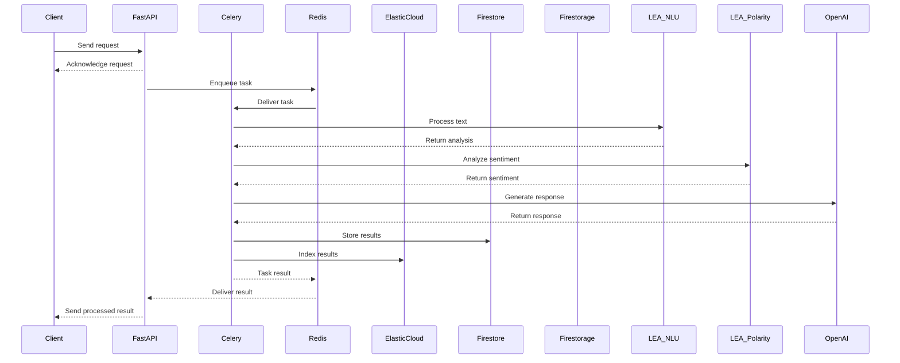

# Proyecto Profesional

## Introducción
El propósito de este proyecto es proporcionar una solución completa que integra múltiples tecnologías para el procesamiento de lenguaje natural, almacenamiento de datos y generación de respuestas automáticas. Utilizamos FastAPI para manejar las solicitudes HTTP, Celery para gestionar tareas en segundo plano, Redis como broker de mensajes, Elastic Cloud para indexar y buscar datos, Firebase para almacenamiento de datos y archivos, LEA NLU y LEA Polarity para análisis de texto, y OpenAI para generación de respuestas.

## Estructura de Carpetas
La estructura de carpetas del proyecto es la siguiente:
```
app/
│
├── main.py
├── celery_config.py
├── tasks/
│   ├── __init__.py
│   ├── task1.py
│   └── task2.py
├── models/
│   ├── __init__.py
│   ├── model1.py
│   └── model2.py
├── schemas/
│   ├── __init__.py
│   ├── schema1.py
│   └── schema2.py
├── routers/
│   ├── __init__.py
│   ├── router1.py
│   └── router2.py
├── services/
│   ├── __init__.py
│   ├── service1.py
│   └── service2.py
└── utils/
    ├── __init__.py
    ├── util1.py
    └── util2.py
```

## Componentes del Sistema
- **Celery**: Sistema de cola de tareas distribuido para ejecutar tareas en segundo plano.
- **Redis**: Base de datos en memoria utilizada como broker de mensajes para Celery.
- **Elastic Cloud**: Servicio de Elasticsearch gestionado para indexar y buscar datos.
- **Firebase (Firestore y Firestorage)**: Plataforma de desarrollo de aplicaciones para almacenamiento de datos y archivos.
- **FastAPI**: Framework web moderno y de alto rendimiento para construir APIs con Python.
- **LEA NLU**: Componente de procesamiento de lenguaje natural para analizar y comprender texto.
- **LEA Polarity**: Componente de análisis de sentimientos para determinar la polaridad del texto.
- **OpenAI**: Plataforma de inteligencia artificial para generación de respuestas automáticas.

## Funcionalidad del Sistema
El sistema permite a los usuarios enviar texto para análisis, subir archivos para almacenamiento, y realizar consultas en los datos almacenados. FastAPI maneja las solicitudes HTTP y encola tareas en Celery a través de Redis. Celery procesa las tareas y puede interactuar con otros componentes como Elastic Cloud, Firebase, LEA NLU, LEA Polarity, y OpenAI. Los resultados se almacenan en Firebase y se indexan en Elastic Cloud. FastAPI devuelve los resultados al cliente.

## Entradas y Salidas del Sistema
- **Entradas**: Texto para análisis, archivos para almacenamiento, y consultas para búsqueda.
- **Salidas**: Resultados de análisis de texto, URLs de archivos almacenados, y resultados de búsqueda.

## Endpoints del Sistema
- **/analyze-text**: Endpoint para enviar texto para análisis.
- **/upload**: Endpoint para subir archivos.
- **/search**: Endpoint para realizar consultas en los datos almacenados.
- **/analysis/{id}**: Endpoint para obtener los resultados de un análisis de texto.
- **/delete-file/{id}**: Endpoint para eliminar archivos.
- **/update-analysis/{id}**: Endpoint para actualizar los resultados de un análisis de texto.
- **/get-file/{id}**: Endpoint para descargar archivos.
- **/all-analyses**: Endpoint para obtener una lista de todos los análisis de texto.
- **/all-files**: Endpoint para obtener una lista de todos los archivos subidos.
- **/stats**: Endpoint para obtener estadísticas del sistema.

## Documentación Adicional
- Para explorar y probar los endpoints de la API, visite la documentación interactiva de Swagger en [Swagger UI](http://localhost:8000/docs).
- Para obtener más información sobre las clases y su funcionamiento, consulte la [documentación de las clases](http://localhost:8000/docs/classes).
- Para obtener más información sobre las pruebas unitarias y cómo ejecutarlas, consulte la [documentación de las pruebas unitarias](http://localhost:8000/docs/tests).

## Arquitectura del Sistema
El siguiente diagrama muestra cómo se conectan los componentes del sistema:



## Docker
### Dockerfile
```dockerfile
FROM python:3.9-slim

# Establecer el directorio de trabajo
WORKDIR /app

# Copiar los archivos de la aplicación
COPY . /app

# Instalar las dependencias
RUN pip install --no-cache-dir -r requirements.txt

# Exponer el puerto de la aplicación
EXPOSE 8000

# Comando para ejecutar la aplicación
CMD ["uvicorn", "main:app", "--host", "0.0.0.0", "--port", "8000"]
```

### docker-compose.yml
```yaml
version: '3.8'

services:
  web:
    build: .
    ports:
      - "8000:8000"
    volumes:
      - .:/app
    environment:
      - REDIS_HOST=redis
      - REDIS_PORT=6379
    depends_on:
      - redis
      - celery
  redis:
    image: "redis:alpine"
    ports:
      - "6379:6379"
  celery:
    build: .
    command: celery -A app.celery_config worker --loglevel=info
    volumes:
      - .:/app
    environment:
      - REDIS_HOST=redis
      - REDIS_PORT=6379
    depends_on:
      - redis
```

### build.json
```json
{
    "azure": {
      "subscription_id": "{{ vault_tf_az_subscription_id }}",
      "tenant_id": "{{ vault_tf_az_tenant_id }}",
      "spn_id": "{{ vault_tf_az_spn_client_id }}",
      "spn_pwd": "{{ vault_tf_az_spn_password }}",
      "docker_pwd": "{{ vault_docker_pwd }}",
      "acr_name": "XXXX"
    },
    "env":"prod",
    "dockerfiles": [
      { "name": "lea-v3", "tag": "0.0.0"}
    ],
    "debug_mode": true
}
```

## Despliegue con Docker
1. Construir la imagen de Docker:
```bash
docker build -t myapp:latest .
```

2. Iniciar los servicios con docker-compose:
```bash
docker-compose up
```

3. Acceder a la aplicación en el navegador:
```
http://localhost:8000
```
